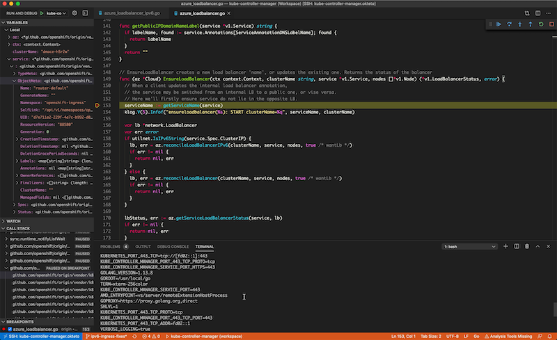

# kube-controller-manager

Note: bidirectional file sync of the OpenShift source tree via syncthing is not yet supported for this component because the tree is too big to make work reliably without a lot of extra steps I'm not ready to publish. For now it's easier to just develop remotely inside the persistent volume and frequently push your changes elsewhere if you're paranoid.

## Getting started

The kube-controller-manager (KCM) hosts, among other things, the deployment and persistent volume controllers, which presents some unique bootstrapping challenges when trying to replace it with an in-cluster development environment. Additionally, it's deployed with host networking and host mounts, and so colocation of replicas is difficult. These properties explain the weird gymnastics below where the KCM is scale/enabled/disabled. Sometimes when developing it's necessary to bring the built-in KCM back to life. There are support scripts to help.

### Prepare the cluster for development

1. Scale KCM down to one replica.

        $ support/kcmctl disable
        $ support/kcmctl enable

2. Install a clone of the KCM in a deployment which hosts the development environment.

        $ support/gen-kcm-deployment | oc apply -f -

### Launch the development environment

1. Create a `.vscode/settings.json` file and tell Okteto where to find your KUBECONFIG, e.g.:

        {
          "okteto.kubeconfig": "/path/to/kubeconfig"
        }

1. Run the `Okteto: Up` command from Visual Studio Code.
2. Select the `kube-controller-manager/okteto.yml` manifest file from the Okteto prompt.
3. Wait for the remote VSCode window to open.
4. Disable the built-in KCM completely.

        $ support/kcmctl disable

### Configure the development environment

From the remote window...

1. Install the [Go extension](https://marketplace.visualstudio.com/items?itemName=ms-vscode.Go).
2. Open the [kube-controller-manager](kube-controller-manager.code-workspace) workspace.
3. For basic functionality and debugging support, install `gopls` and `dlv` using the `Go: Install/Update Tools` command.
3. Clone your [OpenShift](https://github.com/openshift/origin) repo to `/go/src/github.com/openshift/origin`.
4. Reload the window.

Start a debugging session using the built-in `kube-controller-manager` launch configuration.

The `/okteto` directory is bidirectionally synced with your local `kube-controller-manager` directory. The `/go` directory (and some other supporting directories) are mounted from a persistent volume.
